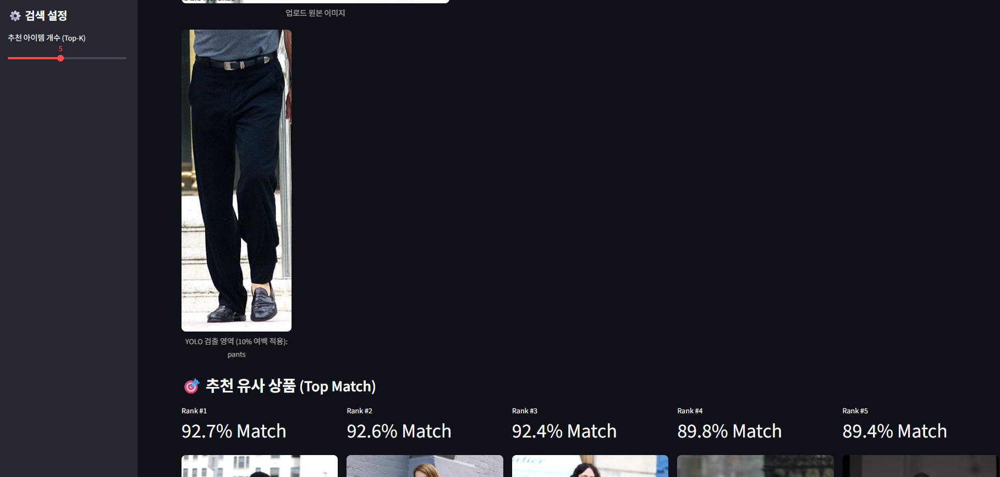
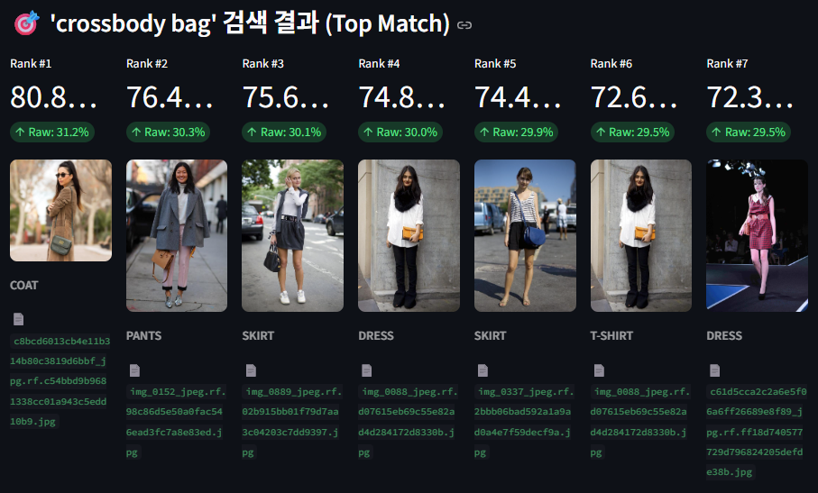

# Multimodal Fashion Search

Search a fashion catalogue by uploading a photo or by describing what you want in
plain language. YOLOv8 finds the garment, CLIP puts the crop and the query text in
one embedding space, Faiss retrieves the neighbours, and FastAPI keeps inference out
of the UI process.

Built during the Comento Computer Vision bootcamp (Jul 2026), individually.
Weeks 1-3 cover the groundwork; week 4 is the search engine.

| | |
| --- | --- |
| Pipeline | YOLOv8 detect → 10% padded crop → CLIP ViT-B/32 (512-d) → L2 normalise → Faiss `IndexFlatIP` → FastAPI → Streamlit |
| Indexed | 749 catalogue images, 1,517 detected garment objects |
| Stack | Python, PyTorch, Ultralytics YOLOv8, CLIP, Faiss, FastAPI, Streamlit, OpenCV, pytest |




## The problem

A detector returns a class label. But two people looking at the same jacket describe
it differently — one sees "boxy and washed out", another sees "vintage beige". If the
detected class name is the search key, none of that survives into the query.

So the goal was to let a user combine a photo with their own wording, and compare
both against the catalogue in a single semantic space.

## Design decision: detection as region extraction, not classification

Week 3 error analysis showed the detector confusing `coat` with `jacket` and `shirt`
with `t-shirt` — classes separated by collar shape and button placement, which a 2D
box around the garment does not capture well. The confusion matrix is in
[`week3/`](week3/).

Instead of pushing fine-grained separation back into the detector through more
fine-tuning, each component was given a narrower job:

| Component | Responsibility |
| --- | --- |
| YOLOv8 | Locate the garment region and silhouette in the user's image |
| CLIP | Map the crop *and* the user's wording into one 512-d space |
| Faiss | Cosine top-k over L2-normalised vectors |
| FastAPI | Hold the models and the index, away from the UI process |
| Streamlit | Image/text input and result display |

Two details that came out of mentor review and are now in
[`week4/config/search_config.yaml`](week4/config/search_config.yaml):

- **`padding_ratio: 0.10`** — YOLO boxes sit tight against the garment, cutting off
  collars and cuffs that carry the visual signal. Crops are expanded 10% on each side.
- **`normalize_l2: true`** — `IndexFlatIP` computes inner product, which only equals
  cosine similarity once the vectors are unit length.

## Detection experiments

Fashion dataset, 9 classes (`coat`, `dress`, `jacket`, `pants`, `shirt`, `shoes`,
`shorts`, `skirt`, `t-shirt`). Full per-class breakdown in
[`week3/Week3 Report.md`](week3/Week3%20Report.md).

| Run | Model | Epochs | Change | mAP50 |
| --- | --- | :---: | --- | :---: |
| Baseline | YOLOv8n | 10 | — | 0.6487 |
| 1 | YOLOv8n | 20 | `augment=True` | 0.6841 |
| 2 | YOLOv8s | 10 | model capacity 3.0M → 11.1M params | 0.6889 |
| 3 | YOLOv8n | 10 | `lr0=0.005` **and** `batch=8` **and** AdamW | 0.5120 |

Under the stricter mAP50-95 the same baseline and YOLOv8s runs scored roughly 0.55
and 0.576.

Run 3 is the one worth reading. It changed three things at once and scored worst, and
with 10 epochs there is no way to tell whether the learning rate, the batch size, the
optimiser, or simple non-convergence caused it. The run was kept in the record rather
than dropped, and later experiments held the baseline fixed and moved one condition
at a time.

Run 1 lifted `t-shirt` from 0.488 to 0.588 — the class with the most shape and print
variation, and the one augmentation should help most.

## The modality gap

Raw text-to-image cosine similarities land around 0.25-0.35, far below the 0.70-0.80
seen on image-to-image queries. This is not a bug in the index. Image and text
embeddings occupy separate cones in CLIP's space, so their absolute similarities are
not comparable across modalities
([Liang et al., 2022](https://arxiv.org/pdf/2203.02053), figure 1).

The practical consequence is that the raw score cannot be shown as a confidence
percentage for text queries, and a threshold tuned on image queries does not transfer.
Ranking within a single modality is still meaningful, which is what the UI relies on.

## Serving

`week4/api.py` exposes the models and index over HTTP so the Streamlit process holds
no weights:

| Endpoint | Purpose |
| --- | --- |
| `GET /health` | Readiness and loaded-model state |
| `POST /search/text` | Text query → top-k items |
| `POST /search/image` | Uploaded image → detect, crop, embed, top-k |
| `GET /items/{item_id}/image` | Serve a catalogue image by id |

YOLO is loaded lazily (`_get_yolo_model()` in
[`week4/src/search.py`](week4/src/search.py)): a text query never needs the detector,
so it is only constructed on the first image request. If YOLO finds no garment, the
whole image is embedded as a fallback rather than returning nothing.

## Running it

All three commands run from the repository root.

```bash
pip install -r week4/requirements.txt

python week4/src/build_index.py           # 1. build the Faiss index
uvicorn api:app --app-dir week4 --port 8000   # 2. inference service
streamlit run week4/app.py                # 3. UI on :8501
```

`week4` is a plain directory rather than a package, so the service is started with
`--app-dir` rather than `week4.api:app`.

The UI reads the service address from `FASHION_API_URL` and falls back to
`http://127.0.0.1:8000`. Paths, crop padding, model name and `top_k` live in
`week4/config/search_config.yaml`.

## What this does not claim

- **No retrieval quality metric.** There is no labelled evaluation set, so no
  Recall@K and no measured precision. Result quality has only been inspected by eye.
- **No latency benchmark.** Per-stage timings for detection, embedding, search and
  the API hop have not been measured repeatedly.
- **Not deployed.** Streamlit (8501) to FastAPI (8000) was verified locally only. No
  Docker image, no GPU server, no cloud.
- **`search_config.yaml` holds absolute Windows paths** from the development machine,
  so a fresh clone needs them edited before the index can be rebuilt.

Next in line: a labelled evaluation set with Recall@K and an error taxonomy, then
repeated per-stage latency measurement.

## Background reading (Korean)

- [Project write-up](https://app.notion.com/p/3b54b931766881cba95cc8662d9b0bbb) — full
  context, weekly progression and retrospective
- [velog series](https://velog.io/@croooquism/series/%EC%A7%81%EB%AC%B4%EB%B6%80%ED%8A%B8%EC%BA%A0%ED%94%84)
  — including notes on the YOLO and CLIP papers
