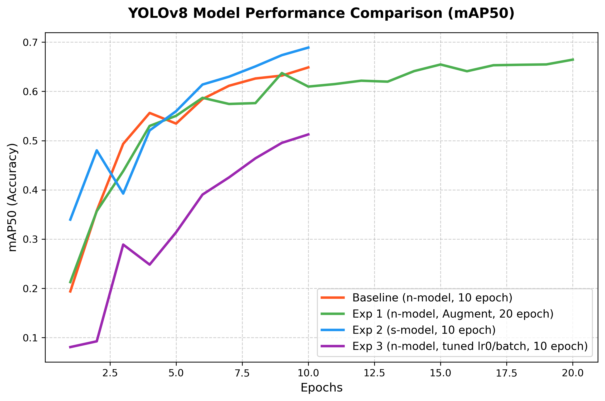
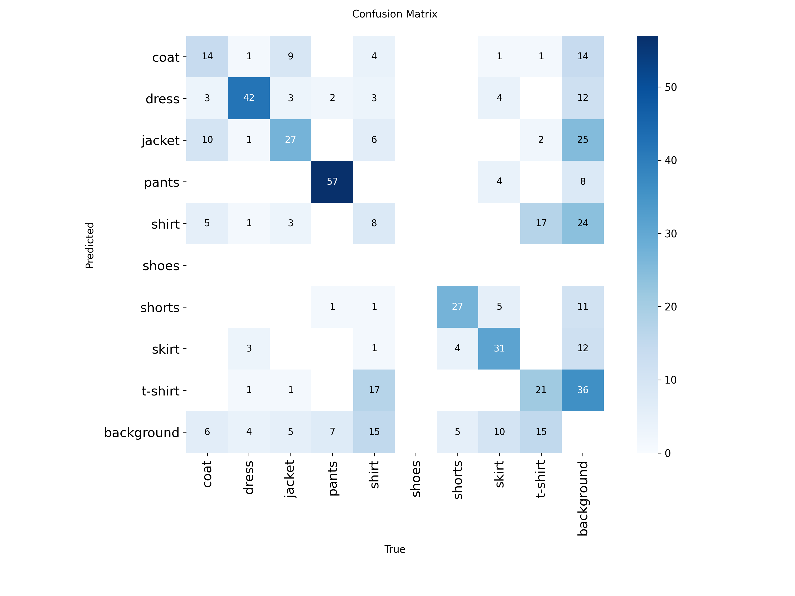
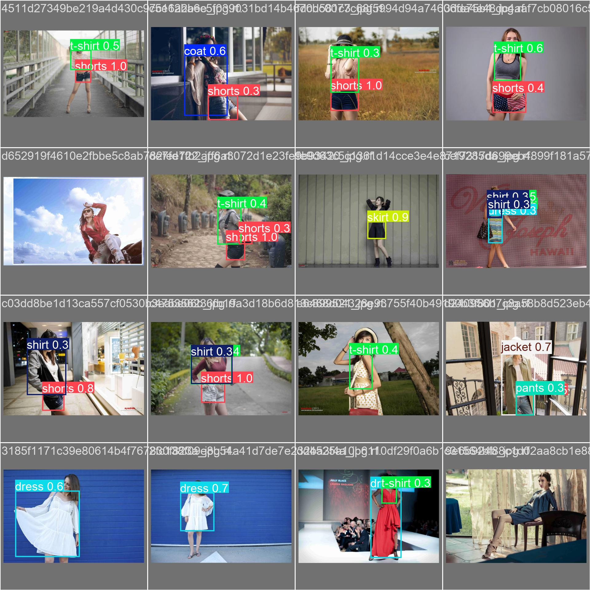

# 🛍️ Week 3: 이커머스 추천 시스템을 위한 YOLOv8 패션 아이템 검출 모델 성능 평가 보고서

본 보고서는 **Shopify, SSENSE, Pinterest** 등의 이커머스 및 비주얼 검색 플랫폼을 타겟팅하기 위한 **"시각 기반 멀티모달 추천 시스템"**의 1단계 모듈로서, **YOLOv8 기반 패션 아이템 검출 모델의 성능 평가 및 비교 분석** 내용을 담고 있습니다.

---

## 📊 1. 전체 실험 요약 및 성능 지표 비교

패션 데이터셋(9개 클래스: `coat`, `dress`, `jacket`, `pants`, `shirt`, `shoes`, `shorts`, `skirt`, `t-shirt`)을 대상으로 수행한 총 4개 실험의 성능 메트릭 비교 결과입니다.

| 실험 구분 | 모델 스펙 | 에포크 | 데이터 증강 | 최적화 설정 | 전체 mAP50 |
| :--- | :--- | :---: | :---: | :--- | :---: |
| **Baseline** | YOLOv8n (나노) | 10 | 기본값 | Auto (디폴트) | **0.6487** |
| **실험 1** | YOLOv8n (나노) | 20 | **적용 (augment=True)** | Auto (디폴트) | **0.6841** |
| **실험 2** | **YOLOv8s (스몰)** | 10 | 기본값 | Auto (디폴트) | **0.6889** |
| **실험 3** | YOLOv8n (나노) | 10 | 기본값 | **학습률 조정 (lr0=0.005, batch=8, AdamW)** | **0.5120** |

### 📈 모델별 mAP50 수렴 추이 비교 그래프
학습 에포크 진행에 따른 각 실험별 mAP50 정확도의 실시간 수렴 곡선입니다.

---

## 🔍 2. 실험별 기술적 원인 분석 (Error & Performance Analysis)

### 💡 [실험 1] 데이터 증강 & 에포크 연장 ➔ 성능 3.5%p 향상
*   **원인**: 이미지 회전, 밝기 조정, Mosaic 증강(`augment=True`)을 적용하여 다양한 착장 조건 및 환경에 대한 강인성(Robustness)을 학습했습니다.
*   **특이사항**: 형태 변화와 무늬가 다양해 오탐율이 가장 높았던 **`t-shirt` 성능이 0.488에서 0.588로 무려 10%p 상승**하여 데이터 증강의 강력한 실용성을 입증했습니다.

### 💡 [실험 2] 모델 체급 스케일업(Nano ➔ Small) ➔ 성능 4.0%p 향상
*   **원인**: 모델의 파라미터 수(Nano 3.0M ➔ Small 11.1M)가 확장되면서, 복잡한 실루엣과 옷감의 미세한 질감을 더 깊게 인코딩할 수 있는 수용력(Capacity)이 확보되었습니다.
*   **특이사항**: 가변성이 매우 큰 아우터웨어인 **`coat`(+9.4%p)**와 **`jacket`(+9.6%p)**에서 압도적인 검출 정밀도 향상이 감지되었습니다.

### ⚠️ [실험 3] 하이퍼파라미터 튜닝 ➔ 성능 13.7%p 하락 (Underfitting / 미수렴)
*   **원인 (경사하강법 및 손실곡선 관점)**:
    1. **보폭(Learning Rate)과 걸음 수(Epoch)의 물리적 불일치**: 초기 학습률(`lr0`)을 `0.01`에서 `0.005`로 절반 가까이 낮춤에 따라 가중치의 업데이트 보폭(Step Size)이 크게 제한되었습니다. 훈련 에포크를 동일하게 10회로 묶은 상태에서 보폭만 축소되었기 때문에 가중치가 전역 최적점(Global Minimum)에 도달하기 전 학습이 조기 종료되었습니다. (미수렴 상태)
    2. **Train Loss 정체 현상 (Underfitting 입증)**: 과적합(Overfitting) 발생 시 나타나는 "Train Loss의 극대 하락 및 Val Loss의 U자형 반등" 패턴과 달리, 본 실험에서는 훈련 이미지 자체도 제대로 학습하지 못해 Train Loss가 베이스라인 대비 높게 정체되는 전형적인 과소적합(Underfitting) 현상이 관찰되었습니다.
    3. **배치 크기 축소로 인한 노이즈 증가**: 배치 크기를 16에서 8로 축소하면서 개별 업데이트 단계에서 경사도(Gradient)의 대표성이 낮아져 수렴 경로 상의 노이즈가 증가하였고, 이로 인해 수렴 지연이 가속화되었습니다.
*   **교훈**: 훈련 에포크와 배치 크기를 변경할 경우, 이에 비례하여 최적의 수렴 속도를 보장할 수 있는 적절한 학습률(Learning Rate) 탐색 및 스케줄링이 반드시 병행되어야 함을 실전 학습 수치로 규명하였습니다.

---

## 🎯 3. 클래스별 혼동 행렬(Confusion Matrix) 및 오류 분석

모델의 성능 불균형 요인을 파악하기 위해 [실험 2 (YOLOv8s)]의 혼동 행렬 및 검증 시각화 결과를 분석했습니다.

### 📷 혼동 행렬 분석

*   **주요 에러 패턴**: 실제 `coat`를 `jacket`으로 잘못 검출하거나, `shirt`를 `t-shirt`로 오인하는 경향성이 확인되었습니다.
*   **원인**: 아우터웨어와 상의는 칼라(Collar), 단추 배열 등의 세밀한 질감 특징이 유사하여 2D 바운딩 박스를 치는 단순 합성곱(CNN) 탐지기만으로는 완벽한 미세 구분이 어렵습니다.

### 📷 검증 셋 예측 시각화 (Validation Predictions)

*(실제 모델이 검증 데이터셋에 대해 탐지한 바운딩 박스와 예측 클래스명 매핑 시각화)*

---

## 🚀 4. 4주차 개인 프로젝트 발전방향 (ML/CV 엔지니어링 JD 조준)

Shopify 및 Pinterest의 ML 엔지니어 요건(대규모 벡터 데이터베이스 매칭, 멀티모달 시맨틱 검색)을 정조준하기 위해, 2D 검출 한계를 우회하는 **2단계 캐스케이드 시스템**을 구축합니다.

1.  **1단계 (Object Detection & Crop)**:
    *   YOLOv8 모델을 활용하여 세부 9종 분류에 집착하기보다, 대분류(`outerwear`, `top`, `bottom`) 영역을 높은 정확도로 검출 및 크롭하여 데이터 신뢰성 확보.
2.  **2단계 (CLIP Feature Extraction & Faiss Vector DB Search)**:
    *   오려낸 이미지 조각을 패션 특화 VLM인 **CLIP (ViT-B/32)** 인코더에 통과시켜 512차원 특징 벡터 추출.
    *   **Faiss Vector DB**에 적재 후 코사인 유사도 검색을 수행하여 카테고리 텍스트(예: *"더블 브레스트 롱 코트"*) 및 데이터베이스 내 유사 의류 제품을 추천하는 웹 데모(Streamlit) 구현 및 Docker 배포.
